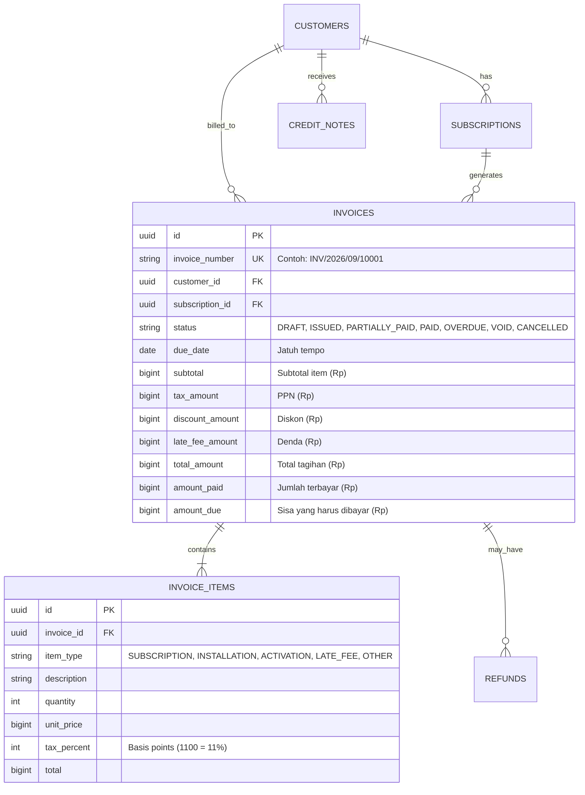
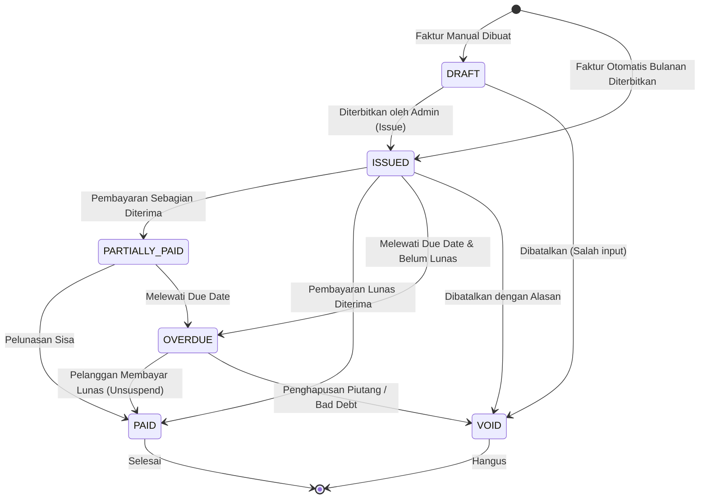
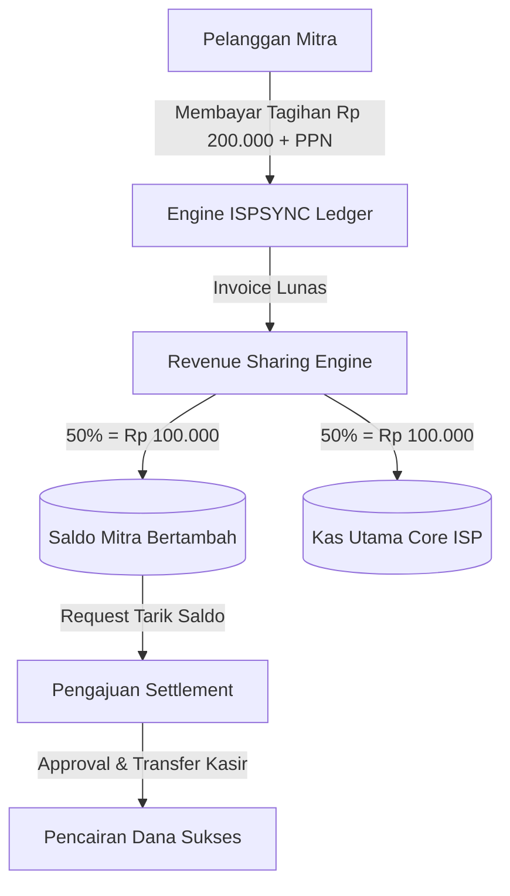

# 📘 Dokumentasi Lengkap & Buku Manual ISPSYNC Ledger (Engine 3)

Dokumen ini berisi panduan komprehensif mengenai **Arsitektur Sistem Billing**, **Siklus Hidup Faktur (Invoice Lifecycle)**, rumus perhitungan keuangan (Proration, PPN, Denda), serta **Buku Manual Operasional (User Manual)** untuk staf Administrasi dan Finance ISP.

---

## 📑 DAFTAR ISI
1. [Ringkasan & Filosofi ISPSYNC Ledger](#1-ringkasan--filosofi-ispsync-ledger)
2. [Arsitektur & Model Data Billing](#2-arsitektur--model-data-billing)
3. [Siklus Hidup Faktur (Invoice Lifecycle)](#3-siklus-hidup-faktur-invoice-lifecycle)
4. [Rumus & Ketentuan Finansial (Engine Rules)](#4-rumus--ketentuan-finansial-engine-rules)
5. [Automated Worker & Scheduler (Otomatisasi Tagihan)](#5-automated-worker--scheduler-otomatisasi-tagihan)
6. [Buku Manual Operasional Admin & Finance (Step-by-Step)](#6-buku-manual-operasional-admin--finance-step-by-step)
   - 6.1. Melihat Daftar Faktur & Indikator Finansial
   - 6.2. Membuat Faktur Manual (Biaya Pasang Baru / Add-on / Denda)
   - 6.3. Menerbitkan Faktur (DRAFT ➔ ISSUED)
   - 6.4. Membatalkan Faktur (VOID)
   - 6.5. Penerimaan & Pencatatan Pembayaran
   - 6.6. Menghubungkan Tagihan dengan Isolir / Suspend Radius
7. [Panduan Portal Publik Pelanggan Cek & Bayar Tagihan (/billing/check)](#7-panduan-portal-publik-pelanggan-cek--bayar-tagihan-billingcheck)
8. [Modul Kemitraan ISP (Reseller) & Sistem Bagi Hasil (Revenue Sharing)](#8-modul-kemitraan-isp-reseller--sistem-bagi-hasil-revenue-sharing)
   - 8.1. Skema Bagi Hasil (Persentase vs Flat Fee)
   - 8.2. Otomatisasi Kredit Saldo Mitra
   - 8.3. Penarikan / Pencairan Dana Mitra (Settlement)
9. [Integrasi Router (MikroTik & Juniper) & RADIUS](#9-integrasi-router-mikrotik--juniper--radius)
10. [FAQ & Troubleshooting](#10-faq--troubleshooting)

---

## 1. Ringkasan & Filosofi ISPSYNC Ledger

Modul ISPSYNC Ledger dirancang khusus untuk memenuhi standar operasional **Internet Service Provider (ISP)** dan **RT/RW Net** di Indonesia:
- **Zero Rounding Loss (Mata Uang Integer Rupiah)**: Seluruh perhitungan nominal uang disimpan dalam satuan `int64` (Rupiah murni tanpa desimal pecahan floating point) untuk menjamin akurasi pembukuan finansial 100%.
- **Otomatisasi Berulang (Recurring Billing Engine)**: Menerbitkan tagihan bulanan secara otomatis berdasarkan siklus langganan pelanggan, tanggal jatuh tempo, dan masa tenggang (*grace period*).
- **Integrasi Jaringan Nyata (RADIUS & AAA Synchronization)**: Pelanggan yang menunggak melewati *grace period* akan otomatis ditandai `OVERDUE` dan langganannya di-*suspend* (isolir) pada MikroTik / FreeRADIUS.

---

## 2. Arsitektur & Model Data Billing

### Diagram Hubungan Entitas (ERD)

---

## 3. Siklus Hidup Faktur (Invoice Lifecycle)

Status faktur merefleksikan posisi pembayaran pelanggan di setiap fase:

| Status | Arti & Perilaku Sistem |
| :--- | :--- |
| **DRAFT** | Faktur masih berupa draf internal. Belum dikirimkan ke pelanggan dan belum dapat dibayarkan. |
| **ISSUED** | Faktur resmi telah terbit. Memiliki nomor resmi, sisa tagihan tercatat, dan pelanggan dapat membayar via QRIS/Transfer/Kasir. |
| **PARTIALLY_PAID** | Pelanggan telah membayar sebagian, sisa `amount_due > 0`. |
| **PAID** | Faktur lunas penuh (`amount_due = 0`). Layanan internet pelanggan aktif/diperpanjang normal. |
| **OVERDUE** | Melewati tanggal jatuh tempo (*due date*). Menjadi dasar bagi sistem untuk menjalankan denda atau pemutusan sementara (isolir). |
| **VOID** | Faktur dibatalkan resmi oleh admin karena kesalahan entri atau kebijakan manajemen. Piutang dihapus. |

---

## 4. Rumus & Ketentuan Finansial (Engine Rules)

Seluruh logika perhitungan terpusat di `apps/api/internal/billing/engine.go`:

### 1. Perhitungan Pajak Pertambahan Nilai (PPN)
Pajak dihitung menggunakan satuan **Basis Points** di mana `1% = 100 bps` (Contoh: PPN 11% = `1100 bps`).
$$\text{TaxAmount} = \frac{\text{Subtotal} \times \text{TaxPercent}}{10000}$$

### 2. Perhitungan Proration (Hari Aktif Proporsional)
Digunakan saat pelanggan berlangganan di pertengahan bulan:
$$\text{ProratedAmount} = \frac{\text{MonthlyPrice} \times \text{DaysUsed}}{\text{TotalDaysInMonth}}$$

### 3. Perhitungan Total Tagihan Bersih
$$\text{TotalAmount} = \text{Subtotal} + \text{TaxAmount} + \text{LateFeeAmount} - \text{DiscountAmount} - \text{CreditApplied}$$
$$\text{AmountDue} = \text{TotalAmount} - \text{AmountPaid}$$

---

## 5. Automated Worker & Scheduler (Otomatisasi Tagihan)

ISPSYNC Ledger memiliki cron-job / background worker berkala:

1. **Invoice Generation Job (`RunInvoiceGenerationJob`)**:
   - Berjalan setiap malam (00:01 WIB).
   - Memindai langganan pelanggan yang mendekati `next_billing_date`.
   - Membuat faktur berstatus `ISSUED` dengan jatuh tempo $H+7$ hari (atau sesuai `grace_period_days`).
   - Memajukan tanggal `next_billing_date` periode berikutnya.

2. **Overdue & Suspension Job (`RunOverdueCheckJob`)**:
   - Berjalan setiap jam.
   - Mengubah faktur yang telah melewati `due_date` menjadi `OVERDUE`.
   - Mengisolir (*Suspend*) akun pelanggan di FreeRADIUS / Router MikroTik jika telah melewati batas dispensasi (*grace period*).

---

## 6. Buku Manual Operasional Admin & Finance (Step-by-Step)

### 6.1. Melihat Daftar Faktur & Indikator Finansial
1. Buka menu Admin: **Billing** (`http://localhost:3000/admin/billing`).
2. Perhatikan 3 ringkasan kartu di bagian atas:
   - **Total Piutang Belum Lunas**: Akumulasi seluruh invoice `ISSUED`, `PARTIALLY_PAID`, dan `OVERDUE`.
   - **Faktur Jatuh Tempo (Overdue)**: Jumlah faktur yang menunggak dan membutuhkan follow-up tim penagihan.
   - **Jumlah Faktur Bulan Ini**: Volume penerbitan faktur pada bulan berjalan.
3. Gunakan filter tab status (Contoh: *Semua*, *Menunggu Pembayaran*, *Lunas*, *Overdue*) untuk memfilter data.

### 6.2. Membuat Faktur Manual (Biaya Pasang Baru / Add-on / Denda)
Faktur manual digunakan apabila ada transaksi di luar langganan rutin bulanan (misal: penggantian kabel fiber optik, biaya instalasi router baru, atau biaya sewa IP Publik statis).

**Langkah-langkah:**
1. Di halaman **Billing**, klik tombol biru **"+ Buat Faktur Manual"** di kanan atas.
2. Isi formulir yang muncul:
   - **Pilih Pelanggan**: Pilih nama/nomor pelanggan target.
   - **Tanggal Jatuh Tempo**: Masukkan batas akhir pembayaran (default: 7 hari ke depan).
   - **Jenis Item**:
     - `SUBSCRIPTION`: Biaya langganan internet
     - `INSTALLATION`: Biaya pasang baru
     - `ACTIVATION`: Biaya aktivasi
     - `OTHER`: Penggantian perangkat / material tambahan
   - **Deskripsi Tagihan**: Tulis keterangan yang jelas (misal: *"Penggantian Dropcore Fiber 50 Meter"*).
   - **Kuantitas & Harga Satuan**: Masukkan nominal harga dalam Rupiah murni (Contoh: `150000`).
   - **PPN (Basis Points)**: Isi `1100` untuk PPN 11%, atau `0` jika non-pajak.
   - **Catatan**: Tambahkan instruksi pembayaran jika ada.
3. Klik tombol **"Simpan Faktur (DRAFT)"**.
4. Faktur berhasil dibuat dan akan muncul dengan status `DRAFT`.

### 6.3. Menerbitkan Faktur (DRAFT ➔ ISSUED)
Faktur dengan status `DRAFT` belum sah menjadi tagihan pelanggan. Untuk mengesahkannya:
1. Cari faktur bersangkutan pada tabel.
2. Klik tombol **"Terbitkan"** (ikon dokumen/pesawat kertas).
3. Konfirmasi pop-up.
4. Status faktur akan berubah menjadi `ISSUED` dengan nomor registrasi unik (Contoh: `INV/2026/09/10005`). Tagihan ini sekarang resmi menjadi piutang dan siap dibayar.

### 6.4. Membatalkan Faktur (VOID)
Jika terjadi salah entri atau pelanggan membatalkan pesanan tambahan:
1. Klik tombol **"Batalkan"** (ikon silang / tempat sampah) pada baris faktur yang ingin dibatalkan.
2. Sistem akan meminta Anda memasukkan **Alasan Pembatalan**.
3. Ketik alasan secara detail (Contoh: *"Pelanggan membatalkan permohonan ganti router"*).
4. Klik **OK**. Status faktur akan berubah menjadi `VOID` dan piutang otomatis nol.
> [!NOTE]
> Faktur yang sudah berstatus `PAID` (lunas) **tidak dapat di-VOID**. Jika terjadi kelebihan bayar, gunakan fitur *Refund* atau *Credit Note*.

### 6.5. Penerimaan & Pencatatan Pembayaran
1. Pelanggan dapat membayar mandiri melalui **QRIS Dinamis** pada portal pelanggan.
2. Jika pelanggan membayar tunai di kantor atau via transfer manual ke rekening kasir:
   - Buka menu **Payments** di dashboard admin.
   - Klik **Catat Pembayaran Manual**.
   - Masukkan ID Faktur, nominal, dan metode pembayaran (*CASH* / *BANK_TRANSFER*).
   - Faktur di modul Billing akan otomatis ter-update menjadi `PAID`.

### 6.6. Menghubungkan Tagihan dengan Isolir / Suspend Radius
- Ketika pelanggan memiliki faktur yang melewati `due_date` + `grace_period`, modul billing menandai akun tersebut sebagai `OVERDUE`.
- Radius Engine ISPSYNC Ledger secara otomatis memindahkan *group profile* akun pelanggan ke profil isolir (*Speed drop ke 64 Kbps* atau *Redirect ke halaman notifikasi isolir*).
- Begitu pelanggan membayar dan status faktur berubah menjadi `PAID`, sistem secara *realtime* melakukan **Unsuspend**, mengembalikan bandwidth internet pelanggan ke profil semula tanpa perlu restart router.

---

## 7. Panduan Portal Publik Pelanggan Cek & Bayar Tagihan (/billing/check)

ISPSYNC Ledger menyediakan portal mandiri (*Self-Service Portal*) yang dapat diakses oleh pelanggan publik tanpa perlu login rumit:
- **URL Akses**: `http://localhost:3000/billing/check` (atau domain publik ISP `https://billing.ispanda.net.id/billing/check`)

### 7.1. Alur Pencarian Tagihan
1. Pelanggan membuka tautan portal pembayaran.
2. Memasukkan salah satu dari 3 parameter identifikasi:
   - **Nomor Pelanggan (Customer ID)**: Contoh `CUST-10023`
   - **Nomor Faktur (Invoice Number)**: Contoh `INV/2026/09/10001`
   - **Nomor WhatsApp / Telepon Terdaftar**: Contoh `081234567890`
3. Klik tombol **"Cek Tagihan"**.
4. Sistem akan menampilkan rincian:
   - Nama Pelanggan & Paket Berlangganan Aktif
   - Masa Aktif Layanan & Jatuh Tempo Pembayaran
   - Status Faktur (`MENUNGGU PEMBAYARAN`, `OVERDUE (MENUNGGAK)`, atau `LUNAS`)
   - Rincian biaya langganan, PPN 11%, denda keterlambatan (jika ada), dan total tagihan bersih.

### 7.2. Pembayaran Instan via QRIS Dinamis
1. Jika tagihan belum lunas, pelanggan mengklik tombol **"Bayar Sekarang via QRIS"**.
2. Gateway ISPSYNC Ledger akan langsung men-generate QRIS Dinamis standar Bank Indonesia (ASPI / EMVCo).
3. Pelanggan memindai (*scan*) QRIS menggunakan aplikasi e-Wallet (GoPay, OVO, Dana, ShopeePay) atau Mobile Banking (BCA, Mandiri, BRI, BNI, dll).
4. Gateway memverifikasi pembayaran secara otomatis melalui webhook real-time:
   - Status tagihan seketika berubah menjadi **PAID (Lunas)**.
   - Layanan internet yang terisolir otomatis terbuka kembali (*auto unsuspend*).
   - Tanda terima lunas (*Digital Receipt*) langsung muncul di layar dan dapat diunduh/dicetak.

---

## 8. Modul Kemitraan ISP (Reseller) & Sistem Bagi Hasil (Revenue Sharing)

Modul **Partner & Reseller** dirancang untuk ISP yang bekerja sama dengan agen lokal, pengelola RT/RW Net, BUMDes, atau Sub-ISP yang memiliki basis pelanggan dan infrastruktur router sendiri.

### 8.1. Skema Pembagian Hasil (Revenue Share Model)
Sistem mendukung skema bagi hasil yang dikonfigurasi per profil mitra:

> [!IMPORTANT]
> **Dasar Perhitungan Bagi Hasil (Dasar Pengenaan Pajak / DPP)**:
> Bagi hasil dihitung murni dari **`Subtotal` faktur (sebelum PPN)**. PPN 11% adalah titipan negara yang wajib disetorkan ISP ke kas negara, sehingga tidak boleh dibagi-hasilkan agar ISP tidak tombok pajak.

1. **PERCENTAGE (Persentase BPS — Contoh 50:50)**:
   - Dinyatakan dalam Basis Points (1% = 100 bps, 50% = `5000 bps`).
   - **Simulasi Tagihan**: Paket Internet Rp 200.000 + PPN 11% (Rp 22.000) = Total Tagihan Pelanggan Rp 222.000.
   - **Pembagian Bagi Hasil 50:50**:
     $$\text{Dasar DPP (Subtotal)} = \text{Rp } 200.000$$
     $$\text{Hak Bersih Mitra (50\%)} = \frac{\text{DPP} \times 5000}{10000} = \text{Rp } 100.000$$
     $$\text{Hak Bersih ISP (50\%)} = \text{DPP} - \text{Hak Mitra} = \text{Rp } 100.000$$
     $$\text{PPN Disetor ke DJP Negara (Kas ISP)} = \text{Rp } 22.000$$
2. **FLAT_FEE (Biaya Pokok Tetap per Tagihan)**:
   - ISP menetapkan biaya pokok per pelanggan (misal: Biaya Bandwidth Pokok ISP Rp 50.000/bulan).
   - Sisa nilai DPP (Subtotal) menjadi hak milik mitra seutuhnya.

### 8.2. Otomatisasi Kredit Saldo Mitra
- Ketika invoice pelanggan yang berada di bawah naungan mitra dinyatakan `PAID`, sistem database secara atomik mencatat riwayat transaksi ke tabel `revenue_shares`.
- Sistem menerapkan *idempotency check* sehingga invoice yang sama tidak akan mengkreditkan saldo mitra lebih dari sekali.
- Saldo (`balance`) pada profil dompet mitra langsung bertambah secara otomatis tanpa memerlukan intervensi manual kasir/admin.

### 8.3. Penarikan Dana Mitra (Settlement Lifecycle)
1. **Pengajuan (PENDING)**: Mitra atau Admin mengajukan permohonan penarikan saldo dengan mencantumkan bank tujuan, nomor rekening, atas nama, dan nominal transfer.
2. **Verifikasi & Approval (APPROVED / TRANSFERRED)**:
   - Bagian Keuangan ISP memverifikasi ketersediaan saldo mitra.
   - Database mengunci saldo mitra menggunakan proteksi `FOR UPDATE` guna mencegah manipulasi atau *double disbursement*.
   - Finance mentransfer dana via Bank/Flip/Xendit dan mengunggah nomor referensi mutasi.
   - Saldo dompet mitra berkurang dan status settlement berubah menjadi `TRANSFERRED`.
3. **Penolakan (REJECTED)**: Jika rekening tidak valid atau terjadi sengketa penagihan, admin dapat menolak permohonan dan saldo mitra tidak terpotong.

---

## 9. Integrasi Router (MikroTik & Juniper) & RADIUS

ISPSYNC Ledger menggabungkan efisiensi AAA FreeRADIUS terpusat dengan fleksibilitas manajemen router modern (MikroTik RouterOS & Juniper Junos).

### 9.1. Pendaftaran Router Terpadu (All-in-One Router Onboarding)
Pada menu **Admin ➔ Jaringan & Router**, proses pendaftaran router telah disatukan:
- **Kredensial API Router**: IP Address, Port API (MikroTik: `8728` / Junos REST: `3443`), Username & Password API. Digunakan untuk sinkronisasi antarmuka, monitoring *resource usage* (CPU, RAM, Uptime), dan manipulasi *address-list* / firewall secara real-time.
- **FreeRADIUS NAS Client**: Centang opsi *"Hubungkan ke FreeRADIUS"* dan tentukan *Shared Secret* (contoh: `testing123`).
- **Hasil**: Sistem secara otomatis memasukkan router ke inventaris perangkat (`devices`) sekaligus mendaftarkannya ke tabel AAA RADIUS (`nas`). Router langsung siap menerima request autentikasi PPPoE / IPoE / Hotspot.

### 9.2. Mekanisme Isolir Otomatis & Pemulihan (Suspend & Unsuspend)
Sistem isolir ISPSYNC Ledger bekerja secara multi-layer (*Hybrid Protection*):

| Komponen | Saat Pelanggan Jatuh Tempo (Isolir) | Saat Pelanggan Melakukan Pembayaran (Unsuspend) |
| :--- | :--- | :--- |
| **FreeRADIUS Engine** | Memindahkan atribut `Framed-Pool` ke pool IP Isolir (misal `10.254.0.0/24`) atau menyematkan atribut `Mikrotik-Group = "ISOLIR"`. | Mengembalikan atribut ke pool IP Normal dan profil kecepatan paket aslinya. |
| **MikroTik RouterOS** | Menambahkan IP pelanggan ke Firewall Address List `ISOLIR_LIST`. Web-proxy / NAT me-redirect seluruh trafik HTTP/HTTPS port 80/443 pelanggan ke landing page peringatan tagihan. | Menghapus IP dari Address List dan mengirim paket CoA / Disconnect Session agar pelanggan langsung memperoleh IP publik/normal. |
| **Juniper Junos BNG** | Menerapkan dynamic policer / filter `COS_ISOLIR` atau memutus sesi pelanggan via Packet of Disconnect (PoD / CoA RFC 3576 port 3799). | Menginisiasi re-autentikasi subscriber profile dengan SLA bandwidth penuh. |

---

## 10. Modul ACS (TR-069 / CWMP) Manajemen Modem ONT & Portal Mandiri Pelanggan

ISPSYNC Ledger terintegrasi dengan **GenieACS** (NBI REST API port `7557` & CWMP port `7547`) untuk mengelola armada Optical Network Terminal (ONT) multi-vendor pelanggan secara terpusat tanpa perlu login satu per satu ke web UI modem di lapangan.

### 10.1. Dukungan Multi-Vendor ONT
Sistem mendukung ONT populer di Indonesia:
- **ZTE**: F609, F670L, F660
- **Huawei**: HG8245H, HG8245H5, HG8145V5
- **Fiberhome**: AN5506-04, HG6243C
- **VSOL / XPON Universal**: V2801SG, V1600D

Mapping parameter TR-069 / TR-098 terstandarisasi:
- **SSID Name**: `InternetGatewayDevice.LANDevice.1.WLANConfiguration.1.SSID`
- **Password WiFi**: `InternetGatewayDevice.LANDevice.1.WLANConfiguration.1.KeyPassphrase` / `PreSharedKey.1.PreSharedKey`
- **Redaman Optik (RX Power)**: `InternetGatewayDevice.WANDevice.1.WANDSLInterfaceConfig.DownstreamAttenuation` atau vendor PON power node.
- **Reboot Perangkat**: `POST /devices/{deviceId}/tasks?connection_request` dengan objek `{"name": "reboot"}`.

### 10.2. Portal Mandiri Pelanggan (`/billing/check`)
Pelanggan dapat melakukan swalayan mandiri tanpa membebani tim Helpdesk/NOC:
1. **Pengecekan Redaman Optik (Kualitas Kabel Fiber)**:
   - Pelanggan dapat melihat visualisasi indikator redaman optik dBm:
     - 🟢 **Bagus / Normal**: -14.0 s/d -24.0 dBm
     - 🟡 **Cukup / Waspada**: -24.1 s/d -27.0 dBm
     - 🔴 **Kritis / Gangguan Kabel**: < -27.0 dBm
2. **Ganti Nama WiFi (SSID) & Password Mandiri**:
   - Pelanggan cukup mengisi form nama WiFi baru dan password baru (min 8 karakter).
   - Backend memvalidasi data dan meneruskannya via GenieACS NBI ke modem pelanggan.
   - Modem otomatis restart radio WiFi dan menerapkan password baru dalam hitungan detik.
3. **Restart / Reboot Modem dari Jarak Jauh**:
   - Pelanggan dapat merestart modem jika koneksi terasa lambat tanpa perlu mencabut adaptor listrik modem.

### 10.3. Manajemen ONT oleh Admin (`/admin/network`)
Pada tab **"Modem ONT Pelanggan (TR-069 ACS)"**, tim NOC dapat:
- Memantau status online/offline semua modem pelanggan.
- Memantau redaman optik (RX dBm) seluruh pelanggan secara terpadu untuk deteksi dini kabel fiber tekuk/putus.
- Melakukan perubahan konfigurasi WiFi massal/individual dan remote reboot.

---

## 11. FAQ & Troubleshooting

#### Q: Mengapa nomor faktur berformat `INV/2026/09/10001`?
Format nomor faktur tersusun dari kode domain `INV`, tahun berjalan `2026`, bulan berjalan `09`, dan nomor urut sekuens database `10001`. Hal ini menjamin nomor faktur unik dan urut sesuai standar akuntansi perpajakan.

#### Q: Bagaimana jika pelanggan menunggak dan terisolir, bagaimana mereka bisa membayar?
Pelanggan yang terisolir tetap dapat mengakses DNS dan alamat IP server ISPSYNC Ledger (Whitelisted Walled Garden). Saat membuka peramban web, mereka otomatis diarahkan ke `/billing/check` untuk langsung melakukan pembayaran QRIS. Setelah scan berhasil, koneksi internet normal kembali dalam < 5 detik.

#### Q: Bagaimana jika mitra ingin mendaftarkan pelanggannya sendiri?
Akun admin dengan role `partner_admin` dapat login ke dashboard dan hanya memiliki akses ke menu pelanggan, router, dan data keuangan miliknya sendiri tanpa melihat data mitra lain ataupun data inti ISP.

#### Q: Apakah staf kasir biasa dapat membatalkan (VOID) faktur?
Hanya akun admin yang memiliki izin (*permission*) `invoices:void` yang dapat melakukan pembatalan. Setiap pembatalan wajib menyertakan alasan tertulis dan tercatat di audit log sistem secara permanen.

#### Q: Bagaimana jika GenieACS server mati atau belum running saat pelanggan ganti password WiFi?
ISPSYNC Ledger memiliki mekanisme toleransi gangguan (*offline graceful fallback*). Perubahan password WiFi pelanggan akan tetap dicatat ke database ISPSYNC Ledger dan sistem mencatat peringatan log tanpa menyebabkan crash/error fatal pada halaman portal pelanggan. Saat GenieACS online kembali, konfigurasi disinkronisasikan ke modem fisik.

---

## 12. Manajemen Domain & Isolasi Jaringan Publik vs Backoffice

Sesuai standar keamanan telekomunikasi tingkat tinggi (*Carrier-Grade*), antarmuka publik dan administrasi internal wajib dipisahkan:

1. **Jalur Publik (`wifi.{tenant}.ispsync.id` atau `hotspot.{brand}.id`):**
   * Digunakan oleh pelanggan untuk membeli voucher online (`/hotspot/buy`), login captive portal (`/hotspot/login`), mengunduh profil Passpoint Hotspot 2.0 (`/passpoint`), serta pendaftaran dan loket agen (`/agent/*`).
   * Dilengkapi proteksi anti-spam bot (honeypot field, cooldown 60s, rate limiter IP).
   * Dilengkapi kompresor kanvas gambar pintar di browser pendaftar (mengurangi foto KTP 10MB menjadi ~180KB, menghemat 97% storage server).
2. **Jalur Internal Terisolasi (`ledger.{tenant}.ispsync.id`):**
   * Khusus staf finance, admin, NOC, dan integrasi API perbankan.
   * Terisolasi penuh dari lalu lintas pengguna voucher hotspot publik.
3. **Pengaturan Domain di Backoffice (`/admin/settings`):**
   * Tab **"Domain & Sub-Brand WiFi"** memungkinkan ISP mengatur sub-brand publik (seperti `@gowifi`), domain akses, DNS A-Record (`103.179.65.73`), dan script Walled Garden MikroTik dengan 1-klik salin.

---

## 13. Integrasi Aplikasi Mobile Kasir Agen & Cetak Printer Thermal

Mitra loket dan agen kasir warung dapat menggunakan **Aplikasi Mobile Universal ISPSYNC Connect** (Android & iOS) yang terhubung ke modul billing:

1. **Direct Bluetooth Thermal Print (ESC/POS):**
   * Mendukung ukuran kertas **58 mm (standar saku)** dan **80 mm (kasir desktop)**.
   * Kompatibel dengan semua merk printer thermal Bluetooth (Panda, Blueprint, VSC, MiniPOS 5802, BellaV, Eppos).
   * Mencetak struk voucher fisik atau kuitansi pelunasan faktur dalam waktu **< 1 detik** tanpa dialog browser.
2. **Koneksi Dual-Platform:**
   * Android: Bluetooth Serial Port Profile (SPP).
   * iPhone (iOS): Bluetooth Low Energy (BLE / GATT) tanpa sertifikasi MFi.
3. **JavaScript Bridge Otomatis:**
   * Halaman web kasir `/agent/dashboard` secara otomatis mengenali aplikasi mobile via `window.AndroidPrinter` & `window.ISPSYNC_MOBILE`.

