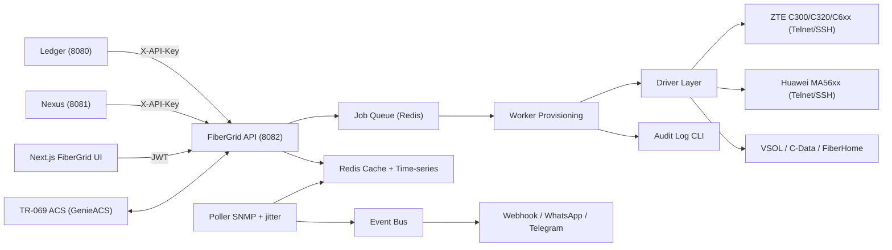

# ISPSYNC FiberGrid — API Blueprint (Benchmark SmartOLT & ZetSet.id)

> Dokumen acuan pengembangan **Engine 1: ISPSYNC FiberGrid** (OLT, ONU, ODC/ODP, TR-069, Wholesale).
> Disusun dari analisa dokumentasi **SmartOLT API** (koleksi Postman resmi, 118 endpoint), riset **ZetSet.id Open API v2.2.0**, dan audit codebase ISPSYNC saat ini.
> Tanggal: 4 Oktober 2026.

---

## 1. Ringkasan Benchmark

| Aspek | SmartOLT | ZetSet.id | Keputusan FiberGrid |
|---|---|---|---|
| Fokus vendor | Multi-vendor (ZTE, Huawei, FiberHome, dll) | Khusus ZTE C3xx & C6xx | Multi-vendor, **ZTE C300/C320 + Huawei MA56xx jadi prioritas 1** |
| Base URL | `https://{tenant}.smartolt.com/api/...` | `https://api.zetset.id/` (Swagger) | `https://fttx.{tenant}.ispsync.id/api/v1/...` + Swagger publik di `/api/docs` |
| Auth | Header `X-Token` (API key per akun, IP allowlist, RO/RW) | `POST /login` (Basic) → Bearer; **custom token** berumur panjang yang bisa direvoke | **Dua lapis**: JWT sesi (UI) + **API Key bernama, scoped, revocable, IP allowlist** (integrasi) |
| Validasi akses | Key valid | Token → role → **langganan aktif** | Token → scope/role → **status langganan tenant** (Ledger) |
| Kunci integrasi | `onu_external_id` (unique, dipasok billing) | Tidak terdokumentasi | **`external_id`** wajib unik per tenant — diisi ID pelanggan Nexus/Ledger |
| Gaya endpoint | RPC verb (`/api/onu/reboot/{id}`), body form-data | REST | **REST resource + sub-action** (`POST /onus/{ext}/reboot`), body JSON |
| Envelope | `{status, response \| error}` | — | `{ok, data, error:{code,message}, meta}` |
| Bulk | Maks 50 ID, `async=1`, `check_bulk_task_status` | — | Maks 50 ID, **selalu async** → `job_id`, polling `/jobs/{id}` + webhook |
| Rate limit | 1.000 call/jam, saran polling 5–7 mnt (status), 15–30 mnt (signal), jitter | — | Budget per API key (default 1.000/jam), header `X-RateLimit-*` |
| Preset | Authorization preset & configuration preset | — | **Provisioning Profile** (gabungan keduanya) |
| Grafik | PNG (signal & traffic: hourly/daily/weekly/monthly/yearly) | History traffic & redaman | **JSON time-series** (untuk chart Next.js) + opsional PNG |
| Peta FTTH | Zone + ODB (splitter) + GPS ONU | OTB → ODC → ODP → ONU + **tiang** | OLT → OTB → ODC → ODP → ONU + **tiang** + rute kabel (sudah ada) |
| Backup | `POST /system/save_config` (manual) | **Backup config OLT otomatis tiap malam** | Backup harian + diff + restore |
| Notifikasi | — | Telegram & WhatsApp (DOWN/LOS) | **Webhook + WhatsApp + Telegram** |
| Harga | — | Rp150rb/OLT/bln (Rp110rb paket 5 OLT), trial 7 hari | Referensi pricing addon `OLT_SLOT` |

---

## 2. Katalog Endpoint SmartOLT (Resmi) → Pemetaan FiberGrid

Notasi: `{ext}` = `external_id` ONU. Semua path FiberGrid diawali `/api/v1`.

### 2.1 OLT & Hardware
| SmartOLT | FiberGrid | Catatan |
|---|---|---|
| `GET /api/system/get_olts` | `GET /olts` | |
| `GET /api/olt/get_olts_uptime_and_env_temperature` | `GET /olts/health` | Uptime, suhu, CPU, RAM |
| `GET /api/system/get_olt_cards_details/{olt_id}` | `GET /olts/{id}/cards` | |
| `GET /api/system/get_olt_pon_ports_details/{olt_id}` | `GET /olts/{id}/pon-ports` | Jumlah ONU, online, rata-rata sinyal, TX power |
| `GET /api/system/get_outage_pons/{olt_id}` | `GET /olts/{id}/outages` | **Deteksi PON putus massal** (semua ONU LOS di satu port) |
| `GET /api/system/get_olt_uplink_ports_details/{olt_id}` | `GET /olts/{id}/uplinks` | |
| `POST /api/system/save_config` | `POST /olts/{id}/save-config` | + `GET /olts/{id}/backups` (versi ZetSet) |
| — | `POST /olts`, `PUT/DELETE /olts/{id}`, `POST /olts/{id}/test-connection` | CRUD (password terenkripsi) |

### 2.2 Katalog & Master Data
| SmartOLT | FiberGrid |
|---|---|
| `GET /api/system/get_onu_types`, `.../get_onu_types_by_pon_type/{pon_type}`, `.../get_onu_type_image/{id}`, `POST add_onu_type` | `GET/POST /onu-types?pon_type=gpon` |
| `GET /api/system/get_zones`, `POST add_zone` | `GET/POST /zones` (= area cluster, mis. `PYK`, `BRO`) |
| `GET /api/system/get_odbs/{zone_id}`, `POST add_odb`, `edit_odb/{ext}`, `delete_odb/{ext}` | `GET/POST/PUT/DELETE /odps` (+ `/odcs`, `/otbs`, `/poles`) — dengan `external_id` |
| `GET /api/system/get_speed_profiles` | `GET/POST /speed-profiles` (map ke paket Ledger) |
| `GET /api/olt/get_vlans/{olt_id}`, `POST add_vlan/{olt_id}` | `GET/POST/DELETE /olts/{id}/vlans` |
| `GET /api/system/get_billing_details` | `GET /account/subscription` |

### 2.3 Provisioning (Unconfigured → Authorize)
| SmartOLT | FiberGrid |
|---|---|
| `GET /api/onu/unconfigured_onus`, `.../unconfigured_onus_for_olt/{olt_id}` | `GET /onus/unconfigured?olt_id=` |
| `GET /api/onu/get_authorization_presets?olt_id&sn&board&port` | `GET /provisioning-profiles?olt_id&sn` |
| `POST /api/onu/authorize_onu` (manual / via preset) | `POST /onus/authorize` → **202 + job_id** |

Field `authorize` (diadopsi dari SmartOLT): `olt_id, pon_type, board, port, sn, onu_type, onu_mode (routing|bridging), vlan, cvlan, svlan, tag_transform_mode, zone, odp, odp_port, name, address, external_id, upload_profile, download_profile, profile_id`. Tambahan FiberGrid: `customer_id` (Nexus), `work_order_id` (SPK), `pppoe_username/password`, `wifi_ssid/password`.

### 2.4 ONU Read (Single & Bulk)
| SmartOLT | FiberGrid |
|---|---|
| `GET /api/onu/get_onus_statuses?olt_id&board&port&zone` | `GET /onus/statuses?olt_id&board&port&zone` |
| `GET /api/onu/get_onus_administrative_statuses` | `GET /onus/admin-statuses` |
| `GET /api/onu/get_onus_catv_statuses` | `GET /onus/catv-statuses` |
| `GET /api/onu/get_onus_signals` | `GET /onus/signals` |
| `GET /api/onu/get_all_onus_details?page&page_size` | `GET /onus?page&page_size&fields=` |
| `GET /api/onu/get_all_onus_gps_coordinates` | `GET /onus/geo` (GeoJSON) |
| `GET /api/onu/get_onu_status/{ext}` · `get_onu_signal/{ext}` · `get_onu_details/{ext}` | `GET /onus/{ext}` · `/status` · `/signal` |
| `GET /api/onu/get_onus_details_by_sn/{sn}` | `GET /onus?sn=` |
| `GET /api/onu/get_onu_full_status_info/{ext}` | `GET /onus/{ext}/diagnostics` (rate-limit ketat) |
| `GET /api/onu/get_running_config/{ext}` | `GET /onus/{ext}/running-config` |
| `GET /api/onu/get_onu_signal_graph/{ext}/{type}` · `get_onu_traffic_graph` | `GET /onus/{ext}/history/signal?range=24h` · `/history/traffic` |
| `GET /api/onu/get_onu_speed_profiles/{ext}` | (bagian dari `GET /onus/{ext}`) |
| `GET /api/onu/get_onu_router_hosts/{ext}` | `GET /onus/{ext}/hosts` (via TR-069) |

### 2.5 ONU Lifecycle & Konfigurasi (Write)
| Kategori | SmartOLT | FiberGrid |
|---|---|---|
| Identitas | `move`, `update_pon_channel`, `update_sn`, `change_onu_type`, `change_custom_profile`, `update_unique_external_id` (by ext / board-port-onu / SN), `update_location_details` | `POST /onus/{ext}/move`, `/replace` (ganti SN), `PATCH /onus/{ext}` (type, lokasi, external_id) |
| Preset | `get_configuration_presets`, `apply_/remove_configuration_preset`, `bulk_apply_/bulk_remove_...`, `check_configuration_preset_task_status` | `POST /onus/{ext}/apply-profile`, bulk via `/onus/bulk` |
| VLAN & mode | `update_attached_vlans`, `update_main_vlan`, `update_onu_mode`, `update_service_port` | `PUT /onus/{ext}/vlans`, `/mode`, `/service-ports/{n}` |
| Mgmt IP | `set_onu_mgmt_ip_inactive/static_ip/dhcp` | `PUT /onus/{ext}/mgmt-ip` `{mode}` |
| TR-069 | `enable_tr069`, `disable_tr069` | `PUT /onus/{ext}/tr069` |
| WAN | `set_onu_wan_mode_setup_via_onu_webpage/dhcp/static_ip/pppoe`, `set_onu_wan_configuration_method`, `set_onu_wan_ip_version` (IPv6) | `PUT /onus/{ext}/wan` `{mode: pppoe\|dhcp\|static\|webpage, method: omci\|tr069, ip_protocol, ipv6...}` |
| Keamanan | `update_max_mac_learn`, `enable/disable_ip_dhcp_snooping`, `dhcp_option82`, `ip_source_guard`, `allow_remote_access_to_wan_ip` | `PUT /onus/{ext}/security` |
| Speed | `update_onu_speed_profiles`, `bulk_update_speed_profiles` | `PUT /onus/{ext}/speed` (dipanggil Ledger saat ganti paket) |
| Port LAN | `set_ethernet_port_lan/iptv/access/hybrid/trunk/transparent`, `shutdown_ethernet_port` | `PUT /onus/{ext}/ethernet-ports/{port}` `{mode, vlan, allowed_vlans, dhcp, enabled}` |
| Wi-Fi | `set_wifi_port_lan/iptv/access/hybrid/trunk/transparent` (+ssid, password, auth_mode), `shutdown_wifi_port` | `PUT /onus/{ext}/wifi/{ssid_index}` |
| VoIP | `set_onu_voip_enabled/disabled`, `enable/disable_onu_voip_port` | `PUT /onus/{ext}/voip` (fase 3) |
| IPTV/CATV | `enable/disable_iptv`, `enable/disable_catv`, `bulk_enable/disable_catv` | `PUT /onus/{ext}/iptv`, `/catv` |
| Web login ONU | `change_web_user_pass` | `PUT /onus/{ext}/web-credentials` |
| Aksi | `reboot`, `resync_config`, `restore_factory_defaults`, `disable`, `enable`, `delete`, `bulk_disable`, `bulk_enable`, `check_bulk_task_status` | `POST /onus/{ext}/{reboot\|resync\|factory-reset\|disable\|enable}`, `DELETE /onus/{ext}`, `POST /onus/bulk`, `GET /jobs/{id}` |

---

## 3. Pola Desain yang Diadopsi

1. **External ID sebagai kunci integrasi (SmartOLT).** Ledger/Nexus cukup tahu `external_id` (mis. `ISPMU-2026-0042`); tidak perlu menyimpan OLT/board/port/SN. Ganti modem (`/replace`) atau pindah port (`/move`) tidak mengubah ID.
2. **Isolir billing via OLT.** `POST /onus/{ext}/disable|enable` jadi jalur isolir lapis-2 (selain RADIUS CoA di Ledger) untuk pelanggan yang menunggak.
3. **Semua operasi tulis ke OLT bersifat async + auditable.** Respons `202 {job_id}`; status `queued → running → success|failed`; simpan perintah CLI, output, dan pengguna/API key yang memicu. Menggantikan pola goroutine *fire-and-forget* yang saat ini menelan error.
4. **Bulk read berbasis filter, bulk write berbasis daftar ID (≤ 50).**
5. **Field projection** `?fields=` untuk melewati array berat (`service_ports`, `ethernet_ports`, `wifi_ports`).
6. **Cache-first telemetry.** Poller internal menulis ke Redis dan time-series; API membaca dari cache (`meta.cached_at`) — API tidak pernah memicu SNMP/Telnet langsung untuk endpoint list.
7. **Poller dengan jitter (SmartOLT).** Status setiap 5 menit ± jitter acak, sinyal tiap 15 menit, katalog tiap 6 jam; dibagi per OLT agar beban tidak serentak.
8. **API key bernama & revocable (ZetSet).** `GET/POST /tokens`, `DELETE /tokens/{id}`, `DELETE /tokens` (revoke semua); scope `onu:read`, `onu:write`, `olt:admin`, `map:write`; IP allowlist.
9. **Gate langganan (ZetSet).** Middleware cek status tenant ke Ledger; tenant suspend → API tulis ditolak `402 SUBSCRIPTION_INACTIVE`.
10. **Backup konfigurasi OLT tiap malam (ZetSet)** dengan riwayat versi dan diff.
11. **Topologi peta lengkap termasuk tiang (ZetSet)**: OLT → OTB → ODC → ODP → ONU + `poles`.
12. **Notifikasi & webhook** (melampaui keduanya): event `onu.los`, `onu.dying_gasp`, `onu.online`, `onu.signal_degraded`, `pon.outage`, `olt.down`, `job.completed` → webhook bertanda tangan HMAC + WhatsApp/Telegram.

---

## 4. Spesifikasi Kontrak FiberGrid API v1

### 4.1 Envelope
```json
{ "ok": true, "data": { }, "meta": { "page": 1, "page_size": 100, "total": 812, "cached_at": "2026-10-04T05:00:00+07:00" } }
{ "ok": false, "error": { "code": "ONU_NOT_FOUND", "message": "ONU dengan external_id ISPMU-2026-0042 tidak ditemukan" } }
```

### 4.2 Header
| Header | Fungsi |
|---|---|
| `Authorization: Bearer <jwt>` | Sesi UI |
| `X-API-Key: fg_live_xxx` | Integrasi (Ledger, Nexus, partner) |
| `Idempotency-Key` | Wajib untuk `POST /onus/authorize` & `/onus/bulk` |
| `X-RateLimit-Limit / -Remaining / -Reset` | Budget API |

Tenant ditentukan dari subdomain (`fttx.{tenant}.ispsync.id`) — **tidak** dari body.

### 4.3 Model ONU (ringkas)
```json
{
  "external_id": "ISPMU-2026-0042",
  "sn": "ZTEGC8A1B2C3",
  "olt": { "id": 3, "name": "OLT-PYK-01" },
  "pon_type": "gpon", "board": 1, "port": 4, "onu_index": 17,
  "onu_type": "ZTE-F670L", "mode": "routing",
  "status": "online",
  "admin_status": "enabled",
  "signal": { "rx_dbm": -21.4, "tx_dbm": 2.1, "olt_rx_dbm": -24.8, "level": "normal", "distance_m": 1843 },
  "service": { "vlan": 666, "upload_profile": "UP-20M", "download_profile": "DOWN-20M", "wan_mode": "pppoe", "pppoe_username": "ispmu0042" },
  "location": { "zone": "PYK", "odp": "ODP-PYK-0150", "odp_port": 3, "lat": -0.2238, "lng": 100.6312 },
  "customer_id": "c1f0...", "last_status_change": "2026-10-04T03:12:00+07:00"
}
```
`status`: `online | offline | los | dying_gasp | disabled | unknown`.
`signal.level` mengikuti standar ambang SOP-FTTX-04: `normal` (-15,0 s/d -23,9) · `warning` (-24,0 s/d -26,9) · `critical` (≤ -27,0) · `los` (≤ -35,0 atau 0).

### 4.4 Job (async)
```json
POST /api/v1/onus/bulk
{ "action": "disable", "external_ids": ["ISPMU-2026-0042", "ISPMU-2026-0043"] }
→ 202 { "ok": true, "data": { "job_id": "job_01J9...", "status": "queued" } }

GET /api/v1/jobs/job_01J9...
→ { "status": "partial", "results": [ { "external_id": "...0042", "status": "success" }, { "external_id": "...0043", "status": "failed", "error": "OLT_TIMEOUT" } ] }
```

### 4.5 Arsitektur Internal



Interface driver (Go):
```go
type OLTDriver interface {
    ListUnconfigured(ctx context.Context) ([]UnconfiguredONU, error)
    Authorize(ctx context.Context, req AuthorizeRequest) (*ProvisionResult, error)
    Delete(ctx context.Context, loc ONULocation) error
    SetAdminState(ctx context.Context, loc ONULocation, enabled bool) error
    Reboot(ctx context.Context, loc ONULocation) error
    UpdateSpeed(ctx context.Context, loc ONULocation, up, down string) error
    UpdateWAN(ctx context.Context, loc ONULocation, wan WANConfig) error
    ReadStatuses(ctx context.Context, filter PONFilter) ([]ONUStatus, error)   // SNMP bulk walk
    ReadSignals(ctx context.Context, filter PONFilter) ([]ONUSignal, error)    // SNMP bulk walk
    RunningConfig(ctx context.Context, loc ONULocation) (string, error)
    BackupConfig(ctx context.Context) ([]byte, error)
}
```

---

## 5. Gap Analysis Codebase ISPSYNC Saat Ini

| # | Temuan | Lokasi | Prioritas |
|---|---|---|---|
| 1 | Eksekusi OLT **mock** (`sleep 200ms` → SUCCESS), tanpa Telnet/SSH/SNMP | `internal/access/olt_dispatcher.go` L86-94 | P0 |
| 2 | Template CLI hardcode (ZTE selalu `ZTE-F660`, Huawei `gpon 0/1`, VLAN 211) | `olt_dispatcher.go` L28-83 | P0 |
| 3 | Route legacy tanpa auth (provision, olts, sync ODP partner) | `cmd/server/main.go` L131-208 | P0 |
| 4 | Endpoint publik ONT Wi-Fi/reboot tanpa auth | `apps/api/internal/acs/handler.go` L39-46 | P0 |
| 5 | Admin key & Google Maps key hardcode; password OLT plaintext | `apps/api/cmd/api/main.go` L494; `apps/web/app/admin/fibergrid/page.tsx` L326; tabel `olts` | P0 |
| 6 | Tidak ada tabel `olts`/`odcs` di `apps/api`; `customer_onts` & `odp_nodes` tanpa `tenant_id` | migrasi `000014`, `000015` | P1 |
| 7 | Error ACS ditelan, goroutine fire-and-forget | `acs/genie_client.go`, `acs/service.go` L75-104 | P1 |
| 8 | Telemetri palsu (default -19,50 dBm; formula `-16.8 - used*0.55`) | migrasi `000014`; `network/odp.go` L138 | P1 |
| 9 | Stub sukses palsu (create/delete ODP, ports, clusters, `olt_status`) | `internal/handler/api_handler.go` L1014, L1193, L1224 | P1 |
| 10 | Host Nexus hardcode `nexus.ispku.ispsync.id`, provider default `GNET-BIARO` (melanggar aturan multi-tenant) | `network/odp.go` L87-144; migrasi `000015` | P1 |
| 11 | Tidak ada bulk, pagination, job tracking, audit log OLT | — | P1 |
| 12 | Dua model data paralel (legacy `odps/olts/subscribers` vs `odp_nodes/customer_onts`) | — | P2 |

### 5.1 Audit Engine FTTX Existing (`Documents\FTTX`, modul `fttx-management`)

Engine ini sudah punya permukaan API yang luas (OLT/ODC/tray/ODP/rute/ONT, monitoring, provisioning, ACS, wholesale, KML), tetapi **sebagian besar operasi perangkat masih simulasi**.

| # | Temuan | Lokasi | Prioritas |
|---|---|---|---|
| E1 | **Backdoor key hardcode** diterima walau env diganti (`gogiga-noc-admin-…`, `fttx-admin-key-2026`, `gogiga-super-owner-…`, `fttx-superuser-key-2026`); key juga diterima via query string | `internal/handler/handler.go` L405-408, L446-449 | P0 |
| E2 | CORS `*` + `AllowCredentials`; `/acs` CWMP tanpa auth; `omci-push` mengeksekusi CLI bebas; role `TECHNICIAN` = admin | `handler.go` L70-83, L116, L387 | P0 |
| E3 | Login telnet OLT **selalu `admin/admin`**; tabel `fttx_olt_devices` tidak punya kolom username/password/port/SSH | `provisioning_service.go` L191, L254-282; `storage.go` L276 | P0 |
| E4 | Telnet via raw TCP tanpa IAC/prompt matching (hanya `sleep`); gagal konek mengembalikan `[OFFLINE/STANDBY]` dengan `err=nil` | `internal/omci/driver.go` L58-104 | P0 |
| E5 | **Data simulasi ditulis ke DB produksi**: poller SNMP mengisi Rx acak bila kosong, `refresh_signal` = nilai lama + jitter, ACS `GetCPE` membuat data palsu | `snmp/poller.go` L86-162; `provisioning_service.go` L285-311; `acs_service.go` L219-242 | P0 |
| E6 | Scan unconfigured ONU tidak menyentuh OLT; hapus ONU di OLT belum ada; ONU-ID dihitung lokal (rawan race) | `provisioning_service.go` L41-44, L104-118 | P1 |
| E7 | Bug SNMP: PON port diturunkan dari index OID terakhir (`"0/"+idx`) — salah untuk ifIndex komposit | `snmp/zte.go` L53 | P1 |
| E8 | ACS hanya mem-parsing Inform; tidak ada antrean RPC (Get/SetParameterValues/Reboot) — ubah Wi-Fi & reboot hanya update DB | `acs_service.go` L302-334 | P1 |
| E9 | **Kontrak ISPSYNC ↔ FTTX putus**: ISPSYNC mengirim key `ispsync-noc-admin-…` (ditolak), memanggil `/wholesale/me/onts/{sn}/wifi` (butuh `X-Wholesale-Key`), dan `POST /fttx/ont/{sn}/reboot` (**tidak ada**; yang benar `/fttx/ont/{id}/action` atau `/fttx/acs/cpe/{sn}/reboot`). Error ditelan sehingga tak terlihat | `apps/api/internal/acs/genie_client.go` | P0 |
| E10 | Single-tenant (tanpa `tenant_id`), tanpa `external_id`; sinkron ODP ke ISPSYNC berbasis `code` saja | `storage.go`; `ispclient/client.go` L102 | P1 |
| E11 | FiberHome & C-Data jatuh ke sintaks CLI ZTE; profil Huawei line/srv statis | `omci/driver.go` L44-55 | P2 |
| E12 | `.env`, `fttx.db`, dan binary ter-commit di repo | root repo | P1 |

**Yang layak dipertahankan:** struktur topologi OLT → ODC (+tray) → ODP → ONT, model wholesale (inquiry → contract → settlement, PPN/PPh 23), template skrip ZTE C320 (tcont/gemport/service-port/`pon-onu-mng` PPPoE/SSID), OID SNMP per vendor, dan ekspor KML.

---

## 6. Roadmap Implementasi

| Fase | Lingkup | Output |
|---|---|---|
| **F0 — Hardening** (1 minggu) | Tutup gap P0 ISPSYNC & engine FTTX: hapus backdoor key & key di query string, CORS ketat, auth `/acs` (Basic/Digest per CPE), batasi `omci-push` ke `olt:admin`, enkripsi kredensial OLT (AES-GCM), **matikan seluruh fallback data simulasi** (atau beri flag `is_simulated`), perbaiki kontrak ISPSYNC ↔ FTTX, keluarkan `.env`/db/binary dari git | Keamanan & kejujuran data |
| **F1 — Fondasi Data** (1–2 minggu) | Migrasi `olts` (+ kredensial terenkripsi, telnet/SSH port), `olt_cards`, `pon_ports`, `onus` (dengan `tenant_id`, `external_id` unik), `zones`, `odcs`, `odps`, `poles`, `speed_profiles`, `onu_types`, `provisioning_profiles`, `jobs`, `olt_audit_logs`, `api_keys` | Skema tunggal multi-tenant |
| **F2 — Driver ZTE C300/C320** (2 minggu) | Ganti raw TCP dengan klien telnet/SSH ber-prompt-matching + session pool & lock per OLT; `ListUnconfigured` (`show gpon onu uncfg`), `Authorize` (ONU-ID dibaca dari OLT), `Delete`, `SetAdminState`, `Reboot`, `UpdateSpeed`, `UpdateWAN` + perbaikan decoding ifIndex SNMP | Provisioning nyata |
| **F3 — API v1 & Job Queue** (2 minggu) | Endpoint §2 inti (OLT, katalog, unconfigured, authorize, ONU read, lifecycle, bulk, jobs), API key, rate limit, Swagger | Kontrak stabil untuk Ledger/Nexus |
| **F4 — Poller & Event** (1–2 minggu) | Poller jitter, cache Redis, riwayat sinyal/traffic, deteksi PON outage, webhook + WhatsApp/Telegram | NOC real-time |
| **F5 — Integrasi Engine** (1 minggu) | Ledger: isolir/aktifkan via `disable/enable`, ganti paket via `PUT /speed`; Nexus: SPK → `authorize` dengan `external_id` pelanggan; BAST otomatis memakai `signal.rx_dbm` | Alur end-to-end |
| **F6 — Ekspansi** | Driver Huawei MA56xx, ZTE C6xx, VSOL/C-Data; backup config harian; TR-069 vendor-specific (TR-098/TR-181); VoIP/IPTV/CATV | Multi-vendor penuh |

---

## 7. Lampiran — Batas & Kebijakan
* Bulk write: maksimal **50** `external_id` per request.
* Budget default: **1.000 request/jam per API key** (bisa dinaikkan per tenant).
* Rekomendasi klien: status tiap 5–7 menit, sinyal tiap 15–30 menit, katalog di-cache ≥ 6 jam, selalu pakai jitter.
* Endpoint berat (`/diagnostics`, `/running-config`): maksimal 30 request/jam per ONU.
* Catatan sumber: endpoint SmartOLT di §2 diambil langsung dari koleksi Postman resmi (`api.smartolt.com`). Detail ZetSet terbatas pada grup auth/token (`/login`, `/me`, `/token/custom`); path OLT/ONU ZetSet tidak dapat diakses publik.
